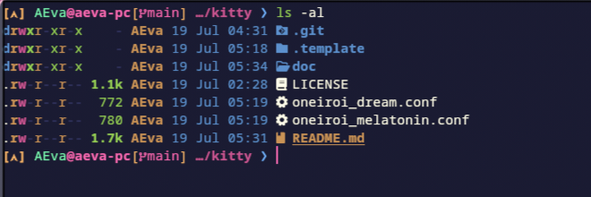

# Oneiroi theme for [Kitty](https://sw.kovidgoyal.net/kitty/)

> A fantastic theme for `Kitty`.

<p align="center">
  
</p>

<p align="center">
  <a href="https://github.com/OneiroiTheme/kitty/stargazers"></a>
  <a href="https://github.com/OneiroiTheme/kitty/issues"></a>
  <a href="https://github.com/OneiroiTheme/kitty/contributors"></a>
</p>

## Themes available

- oneiroi dream

<p align="center">
  
</p>

- oneiroi melatonin

<p align="center">
  
</p>

## Installation

Compile and install:

1. Clone this repository

    ```bash
    git clone "https://github.com/OneiroiTheme/kitty.git" ./kitty
    cd ./kitty
    ```

2. Install themes

    Place theme files inside the `themes` folder under your `kitty config directory`.

    ```bash
    mkdir -p ~/.config/kitty/themes
    cp ./*.conf ~/.config/kitty/themes
    ```

3. Changing the theme

    ```bash
    kitten themes --reload-in=all oneiroi dream
    ```

Hello fantasy world!
